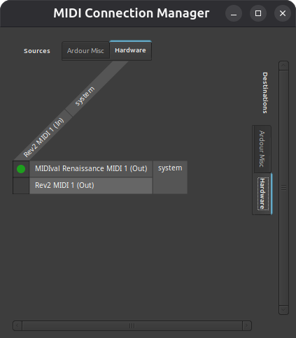

# MIDIval Renaissance

This repository contains firmware for a device which allows the [Micromoog Model 2090](https://en.wikipedia.org/wiki/Micromoog), a monophonic analog synthesizer produced by Moog Music from 1975 to 1979, to respond to <abbr title="Musical Instrument Digital Interface">MIDI</abbr> input. Written in [Rust](https://rust-lang.org/) using the [Embassy](https://embassy.dev/) framework, it translates MIDI messages into electrical signals compatible with the Moog Open System, more or less a flavor of [CV/gate](https://en.wikipedia.org/wiki/CV/gate).

Presently the device is based on the [Nucleo-F767ZI development board](https://www.st.com/en/evaluation-tools/nucleo-f767zi.html), which is powered by an F7-series STM32 microcontroller.

This project is in its prototyping phase. For the foreseeable future, the MIDIval Renaissance will focus on providing external controllers full access to the feature set of the Micromoog as well as extending those features. Planned extensions include making the note priority configurable, adding arpeggiation, providing BPM (beats per minute) context, and supporting keyboard expression (such as aftertouch) that the original hardware isn't equipped to handle. Support for additional synthesizers may be considered at a later date.

## Features

Initial development is focused providing the performer's MIDI controller all the functionality of the Micromoog's keyboard. This requires interfacing with the synth's S-Trig and KBD modules. The status of that work is detailed by module below.

Watch this space for a more detailed roadmap.

### S-Trig Input

The purpose of the switch trigger is to signal the beginning and end of the synth's loudness and filter contours, i.e., to tell it when to sound and when to rest. The MIDIval Renaissance currently implements this exactly as does the Micromoog. That is, the contours are reset anytime there is a break between notes, but notes played legato will be voiced within the same envelope contours.

On the roadmap, but not yet implemented, is a setting which would reset the contours each time a different note is voiced, regardless of how it is articulated. This means you'd get your filter sweep or volume fade-in on every new note, even if you didn't play precisely enough to leave a tiny gap between releasing one key and pressing the next.

### Keyboard Input

The KBD OUTPUT jack of the Micromoog is a dual-purpose jack which also receives input. When in input mode, it receives a signal indicating the note to voice.

When multiple notes are played, only the lowest note is expressed. This is known as low-note priority. The MIDIval Renaissance enables three additional note priority settings: first-played, last-played, and high-note.

A "chord cleanup" setting complements these note priorities, inserting a slight delay between MIDI input and eletrical output to account for human imprecision. If you are playing chords on your controller and have your note priority set to low, it stands to reason that you're expecting "bass lines for free" from the Micromoog. This setting enables "close enough" timing (the span of a 32nd note, assuming 120 BPM) for all the keypresses associated with the performance of a chord, so that the Micromoog doesn't play the third or the fifth for a split second on those occasions where they land before the root note.

Also implemented in the KBD module is the Micromoog's glide or portamento feature. It is not yet supported by the MIDIval Renaissance.

## The Hardware

The prototype is comprised of the following components:

- Nucleo-F767ZI development board (1)
- breadboard (1)
- NMJ4HCD2 1/4" TS (tip/sleeve) switched mono jack (2)
- 10K resistor (1)
- S9013 NPN (negative-positive-negative) transistor (1)
- pushbutton switch (1)

Not included in this list: the cables required to connect the prototype to the Micromoog or other devices.

The following diagram (also available on [Cirkit Designer](https://app.cirkitdesigner.com/project/f18956fb-62a4-4b81-830d-1114c3f1d9e9)) shows how the components are wired:


The top jack in the diagram connects to the Micromoog's KBD port. Its non-normalled tip pin is wired to GPIO PA4 via the yellow wire.

The bottom jack connects to the Micromoog's S-Trig port. Note that this circuit is for connecting via a bona fide S-Trigger cable, not a V-Trigger-to-S-Trigger cable. Either the emitter or the collector terminal of the transistor can be wired to the non-normalled tip pin of the audio jack (the orangle wire); the unused one goes to ground (teal wire). The transistor's center terminal (the base) is wired to GPIO PG0 via the red wire and the 10K resistor.

Finally, the pushbutton switch is wired to GPIO PD1 via the dark blue wire.

## Flashing the Firmware

First, clone this repository:

```
git clone git@github.com:universalhandle/midival_renaissance.git
```

This project uses [probe-rs](https://probe.rs) for debugging and flashing the MCU. Install it if you haven't already. Connect the Nucleo board's programmer (i.e., the ST-LINK/V2-1) to your computer via USB. Change directories into the root of the repository you cloned in the step above, then execute:

```
cargo run --release
````

This command compiles the firmware, installs it on your development board, and prints debug information to your terminal. When the device prints "Initializing MIDIval Renaissance," it is ready to use. If you wish you may hit Control + C to stop the debugger.

## Usage Notes

See [Known Issues](#known-issues) for details on how to power the device and why it must be used with a laptop (or other host device). Once connected, your computer should recognize the MIDIval Renaissance as a device which can receive MIDI input. Configure your DAW or other software to send it MIDI. The MIDIval Renaissance listens on all channels.

See [The Hardware](#the-hardware) for information on how to connect the MIDIval Renaissance to your Micromoog. You may also wish to review the Micromoog user manual.

True to the Micromoog's physical keyboard, the MIDIval Renaissance accepts note input from F3 to C6. Note data outside of this range will be logged and ignored.

The blue button on the Nucleo board cycles through the note priority options. This setting determines which note will sound when multiple keys are pressed. The red LED on the board indicates the active selection.

| Number of blinks | Option             |
| ---------------- | ------------------ |
| 1                | First-played       |
| 2                | Last-played        |
| 3                | Low-note (default) |
| 4                | High-note          |

The button on the breadboard toggles "chord cleanup" mode. When the blue LED is solid, the feature is enabled. See [Keyboard Input](#keyboard-input) for details on its implementation.

## Known Issues

- The Nucleo board's USB port cannot be used to power the device. The USB port on the debugger/programmer, however, can. Be sure to power the device connecting its USB data port.
- Embassy [has not yet fully implemented USB Host mode](https://github.com/embassy-rs/embassy/issues/3295), so this device can only be used as a peripheral. If you're looking to feed MIDI from a laptop-hosted <abbr title="digital audio workstation">DAW</abbr> to a Micromoog, this presents no problem for you. If instead you wish to live-play from a controller, you'll need to use a laptop as an intermediary for now, as shown in the following [Ardour](https://ardour.org/) screenshot, where the MIDI output of the Rev2 is routed to the input of the MIDIval Renaissance:



## Disclaimer

I highly value my Micromoog, and I am terrified of sending it damaging voltages. Every time I make a change to this project—be it adding a new hardware component or changing some code—I use a multimeter to ensure the device's outputs match expectations before connecting it to the synth. I recommend you do the same.

## Resources

Detailed documentation for the firmware can be viewed in your browser by executing the following command from the root of this repository:

```
cargo doc --open
```

Resources that I've found helpful in developing this project include:

- [Moog Micromoog Operation Manual (14-003)](https://www.drtomrhea.com/_files/ugd/a27ff8_8c3778263a29409b90cc9aaf377ed0d3.pdf)
- [Technical Service Manual for Moog Micromoog/Multimoog (993-040188-002)](https://archive.org/details/MOOG_Multimoog_Micromoog_schematics_service_manual/mode/2up)
- [STM32 Nucleo-144 boards (MB1137) - User manual](https://www.st.com/content/ccc/resource/technical/document/user_manual/group0/26/49/90/2e/33/0d/4a/da/DM00244518/files/DM00244518.pdf/jcr:content/translations/en.DM00244518.pdf)
- [STM32F76xxx and STM32F77xxx advanced Arm®-based 32-bit MCUs (RM0410) - Reference manual](https://www.st.com/resource/en/reference_manual/rm0410-stm32f76xxx-and-stm32f77xxx-advanced-armbased-32bit-mcus-stmicroelectronics.pdf)

## Contributing

Issues, pull requests, feature requests, and constructive criticism are welcome.

I will also accept your donated or lent—if you _must_ have it back—synthesizer ;-)

Special thanks to Andy Gunn for helping me work through some early electrical issues.

## License

MIDIval Renaissance is distributed under the terms of both the [MIT license](./LICENSE-MIT)
and the [Apache License (Version 2.0)](./LICENSE-APACHE).

Any contribution intentionally submitted for inclusion in the work by you, as defined in the
Apache-2.0 license, shall be dual licensed as above, without any additional terms or conditions.
