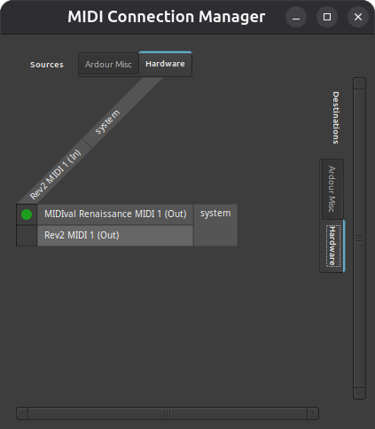

# MIDIval Renaissance

This repository contains firmware for a device which enables the [Micromoog Model 2090](https://en.wikipedia.org/wiki/Micromoog), a monophonic analog synthesizer produced by Moog Music from 1975 to 1979, to interface with modern music equipment by translating [MIDI](https://midi.org/midi-1-0) messages into electrical signals compatible with the Moog Open System, a flavor of [CV/gate](https://en.wikipedia.org/wiki/CV/gate). The firmware is written in [Rust](https://rust-lang.org/) using the [Embassy](https://embassy.dev/) framework.

Presently the device is based on the [Nucleo-F767ZI development board](https://www.st.com/en/evaluation-tools/nucleo-f767zi.html), which is powered by an F7-series STM32 microcontroller.

This project is in its prototyping phase. For the foreseeable future, the MIDIval Renaissance will focus on providing external controllers full access to the feature set of the Micromoog as well as extending those features. Planned extensions include arpeggiation, providing BPM (beats per minute) context, and supporting keyboard expression (such as aftertouch) that the original hardware isn't equipped to handle. Support for additional synthesizers may be considered at a later date.

## Features

Initial development centers on providing the performer's MIDI controller all the functionality of the Micromoog's keyboard, which is achieved by interfacing with the synth's S-Trig and Kbd inputs. Currently supported:

- **Note selection.** Hardly worth mentioning. Press a key, hear the associated note.
- **Envelope generation.** A note played on an external controller triggers the synth's loudness and filter envelopes as if played on the native keyboard: the contours are reset any time there is a break between notes, but notes played legato will be voiced within the same envelope contours.
- **Portamento.** Glide between notes per the Portamento Time (MIDI <abbr title="control change">CC</abbr> 5). With a control value of 0, pitch changes instantly, while the max control value of 127 spreads the change over 5 seconds. Like the Micromoog, glide occurs regardless of articulation (e.g., legato vs. staccato). Unlike the Micromoog (oops!), the portamento produced by the MIDIval Renaissance is [untracked](https://www.reddit.com/r/synthdiy/comments/1ra9l81/question_about_portamento_terminology/), whereas the Micromoog holds the last position of the glide on note off.
- **Configurable note priority.** When multiple notes are played on the Micromoog's keyboard, only the lowest note is expressed. This is known as low-note priority. The MIDIval Renaissance enables three additional note priority options: first-played, last-played, and high-note.
- **Chord cleanup.** Complements the note priority configuration, accounting for human imprecision by inserting a slight delay (the span of a 32nd note, assuming 120 BPM) between MIDI input and eletrical output. For example: with note priority set to low, a performer would expect the Micromoog to provide "bass lines for free" for any performed chord. This setting enables "close enough" timing for all the keypresses that comprise the chord so that the Micromoog doesn't play the third or the fifth for a split second should they land before the root note.

Integrations with the Filter, Osc, and Modulation inputs will come later. There are no plans around the Audio input. A more detailed roadmap is beginning to take shape [here](https://github.com/universalhandle/midival_renaissance/milestones?sort=title&direction=asc).

## The Hardware

The prototype is comprised of the following components:

- Nucleo-F767ZI development board (1)
- breadboard (1)
- NMJ4HCD2 1/4" TS (tip/sleeve) switched mono jack (2)
- 10K resistor (1)
- S9013 NPN (negative-positive-negative) transistor (1)
- pushbutton switch (1)

Not included in this list: jumper wires or the cables required to connect the prototype to the Micromoog or other devices.

The following diagram (also available on [Cirkit Designer](https://app.cirkitdesigner.com/project/f18956fb-62a4-4b81-830d-1114c3f1d9e9)) shows how the components are wired:


The top jack in the diagram connects to the Micromoog's Kbd port. Its non-normalled tip pin is wired to GPIO PA4 via the yellow wire.

The bottom jack connects to the Micromoog's S-Trig port. Note that this circuit is for connecting via a bona fide S-Trigger cable, not a V-Trigger-to-S-Trigger cable. Either the emitter or the collector terminal of the transistor can be wired to the non-normalled tip pin of the audio jack (the orangle wire); the unused one goes to ground (teal wire). The transistor's center terminal (the base) is wired to GPIO PG0 via the red wire and the 10K resistor.

Finally, the pushbutton switch is wired to GPIO PD1 via the dark blue wire.

## Flashing the Firmware

First, clone this repository:

```text
git clone git@github.com:universalhandle/midival_renaissance.git
```

This project uses [probe-rs](https://probe.rs) for debugging and flashing the MCU. Install it if you haven't already. Connect the Nucleo board's programmer (i.e., the ST-LINK/V2-1) to your computer via USB. Under the root of the repository you cloned in the step above, change directories into `crates/firmware` and execute:

```text
cargo embed
```

This command compiles the firmware and installs it on your development board. If you're developing and want debug information in your terminal, instead run:

```text
cargo run
```

When the device prints "Initializing MIDIval Renaissance," it is ready to use. If you wish you may hit Control + C to stop the debugger.

## Usage Notes

See [Known Issues](#known-issues) for details on how to power the device and why it must be used with a laptop (or other host device). Once connected, your computer should recognize the MIDIval Renaissance as a device which can receive MIDI input. Configure your DAW or other software to send it MIDI. The MIDIval Renaissance listens on all channels.

See [The Hardware](#the-hardware) for information on how to connect the MIDIval Renaissance to your Micromoog. You may also wish to review the Micromoog user manual.

True to the Micromoog's physical keyboard, the MIDIval Renaissance accepts note input from F3 to C6. Note data outside of this range will be logged and ignored.

**The blue button on the Nucleo board cycles through the note priority options.** This setting determines which note will sound when multiple keys are pressed. The red LED on the board indicates the active selection:

| Number of blinks | Selection          |
| ---------------- | ------------------ |
| 1                | First-played       |
| 2                | Last-played        |
| 3                | Low-note (default) |
| 4                | High-note          |

**The button on the breadboard toggles "chord cleanup" mode.** When the blue LED on the Nucleo board is solid, the feature is enabled. This mode is intended for live-playing through a controller. As it batches and "swallows" notes by design, users will likely want to disable it if they intend to drive the attached synthesizer from a sequencer or MIDI file, where human imprecision is not a factor.

## Known Issues

- The Nucleo board's USB port cannot be used to power the device. The USB port on the debugger/programmer, however, can. Be sure to power the device before connecting its USB data port.
- This device can be used only as a peripheral, as Embassy [has not yet fully implemented USB Host mode](https://github.com/embassy-rs/embassy/issues/3295). If you're looking to feed MIDI from a laptop-hosted <abbr title="digital audio workstation">DAW</abbr> to a Micromoog, this presents no problem for you. If instead you wish to live-play from a controller, you'll need to use a laptop as an intermediary for now, as shown in the following [Ardour](https://ardour.org/) screenshot, where the MIDI output of the Rev2 is routed to the input of the MIDIval Renaissance:



## Disclaimer

I highly value my Micromoog, and I am terrified of sending it damaging voltages. Every time I make a change to this project—be it adding a new hardware component or changing some code—I use a multimeter to ensure the device's outputs match expectations before connecting it to the synth. I recommend you do the same.

## Resources

Detailed documentation for the firmware can be viewed in your browser by executing the following command from either `crates/firmware` or `crates/software`:

```
cargo doc --open
```

Resources that I've found helpful in developing this project include:

- [Moog Micromoog Operation Manual (14-003)](https://www.drtomrhea.com/_files/ugd/a27ff8_8c3778263a29409b90cc9aaf377ed0d3.pdf)
- [Technical Service Manual for Moog Micromoog/Multimoog (993-040188-002)](https://archive.org/details/MOOG_Multimoog_Micromoog_schematics_service_manual/mode/2up)
- [STM32 Nucleo-144 boards (MB1137) - User manual](https://www.st.com/content/ccc/resource/technical/document/user_manual/group0/26/49/90/2e/33/0d/4a/da/DM00244518/files/DM00244518.pdf/jcr:content/translations/en.DM00244518.pdf)
- [STM32F76xxx and STM32F77xxx advanced Arm®-based 32-bit MCUs (RM0410) - Reference manual](https://www.st.com/resource/en/reference_manual/rm0410-stm32f76xxx-and-stm32f77xxx-advanced-armbased-32bit-mcus-stmicroelectronics.pdf)

## Contributing

Issues, pull requests, feature requests, and constructive criticism are welcome.

I will also accept your donated or lent—if you _must_ have it back—synthesizer ;-)

Special thanks to Andy Gunn for helping me work through some early electrical issues.

## License

MIDIval Renaissance is distributed under the terms of both the [MIT license](./LICENSE-MIT)
and the [Apache License (Version 2.0)](./LICENSE-APACHE).

Any contribution intentionally submitted for inclusion in the work by you, as defined in the
Apache-2.0 license, shall be dual licensed as above, without any additional terms or conditions.
